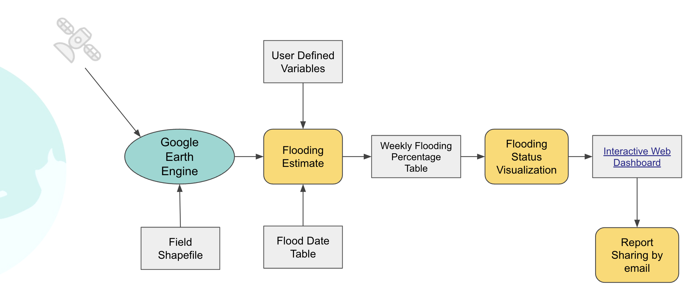
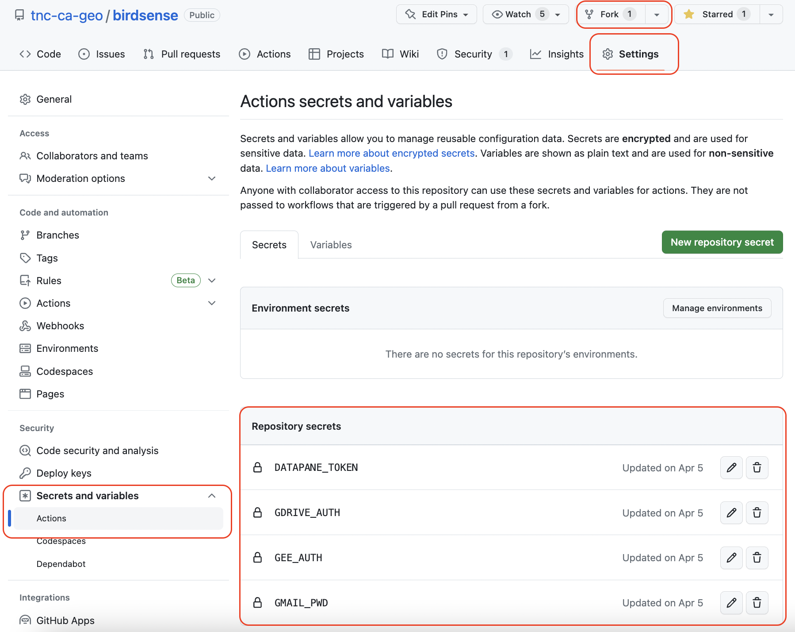
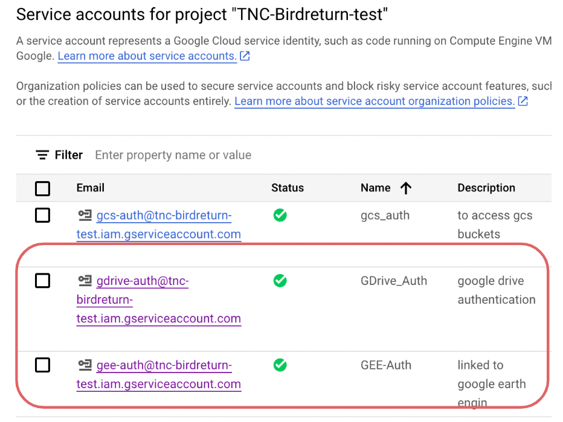
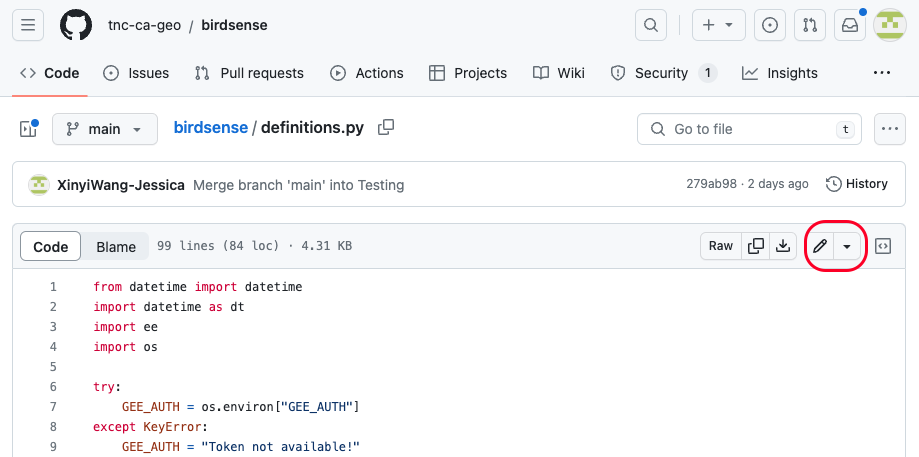
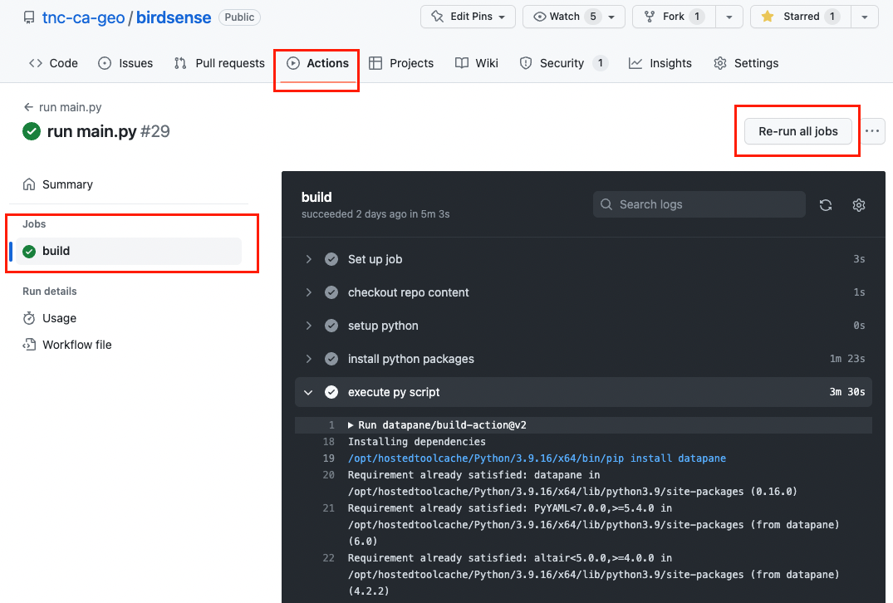

# TNC BirdSense Report Automation Workflow

Project Members: [Wan-Chun Liao](https://github.com/elenaliao1002), [Xinyi(Jessica) Wang](https://github.com/XinyiWang-Jessica)   
Project Mentors: Kirk Klausmeyer, Natty Rindlaub, Cody Carroll

Every year, over 1 billion birds migrate along the Pacific Flyway and travel through California. Many of these birds need wetlands for food and rest to support their journey, but over 95% of the historical wetlands in the Central Valley have been drained and developed. The Nature Conservancy and partners recently launched a program called BirdReturns to pay farmers to flood their fields to support migratory wetland birds.   

For more information, refer to [BirdReturns: A Habitat Timeshare for Migratory Birds](https://www.nature.org/en-us/about-us/where-we-work/united-states/california/stories-in-california/migration-moneyball/).  

As the program scales up with government funds to combat the impacts of the drought, new tools are needed to ensure that farmers flood their fields for the full duration of their contract. The current program has been experimenting with using free images captured by satellites to estimate the extent and duration of flooding on the enrolled fields.   

Based on the promising experiment outcomes, this GitHub Repository is aimed to build a data pipeline to 1) ingest the satellite data, 2) generate flooding extent estimates, and 3) automatically send weekly reports to the field staff who manage the program.  

This repo utilizes the GitHub Action workflow to build a data pipeline, as shown in the figure below:



## Features:
The main features of the BirdSense Workflow are:
- Extract satellite data from Sentinel 2 from Google Earth Engine API
- Process data to obtain the percent of flooding and cloud-free indicator by fields
- Extract field enrollment data from Google Drive API
- Generate a dashboard report through DataPane APP (example screenshot)
- Schedule workflows for multiple programs
- Share dashboard report by email
- Log workflow actions in status.log

## Preparation
To create your own workflow, Fork (button at top)this repository to your workspace.
From the drop-down menu of your profile at the top right corner and select "Your repositories". Find the forked BirdSense repo.
Follow the steps below to obtain the required authentications and add to the repository secrets. As the outcome of the preparation, your repo action secrets will be set as below:



### Create a Google Cloud Project
A Google Cloud project service account is required to obtain authentications for GEE and Google Drive. 
  1. Go to [Google Cloud](https://console.cloud.google.com/) and create an account following the [Instruction](https://cloud.google.com/apigee/docs/hybrid/v1.7/precog-gcpaccount)
  2. Create a GCP project following the [Create a Google Cloud project](https://cloud.google.com/apigee/docs/hybrid/v1.7/precog-gcpproject) instruction.
    * You may need to provide billing information for creating GCP project. No actual charge will happen for GCP authentication.


### GEE Authentication with Google Service Account
To access data from GEE API, Google Service Account is used to authenticate to Earth Engine. To do so, follow the [guide to create a service account](https://developers.google.com/earth-engine/guides/service_account) and complete the steps below:

  1. Choose the created project and create a Service Account by selecting IAM & Admin => Service Accounts +> CREATE SERVICE ACCOUNT 
  2. Create a private key for the Service Account and download the JSON key file
  3. Register your service account for use with the Earth Engine API.
  4. Save the JSON key content as a repo secret with the name of GEE_AUTH under the repo Settings 
  5. In definitions.py, update the "ee_account" variables with the email associated with your GCP service account as below:
  ```
    ee_account = 'gee-auth@your_service_account_email.iam.gserviceaccount.com'
  ```
  
### Google Drive API Authentication (Optional)
Google Drive is an optional place to store any other sensitive information without additional cost. Skip this step if you don't plan to store data in Google Drive. 
Google Drive Python API is used to download files stored in Google Drive. The [Google Python Quickstart](https://developers.google.com/drive/api/quickstart/python) provides guidelines to enable the API and set up the Authorize credentials. The following steps describe how to set up Google Drive API and access an Excel file in google drive:

  1. Create a Google Service Account and create a Key. Download the JSON key file and copy the service account email. 
  2. Enable Google Drive API for the Google Cloud Project setup from the previous step. 
  3. Grant the Google Drive folder/file access to the Service Account just set up using the Service Account email.
  4. Copy the Google Drive folder/file id from the URL. 
  5. Save the JSON key content as a repo secret with the Name GDRIVE_AUTH under the repo Settings.

Instead of the Google Python Quickstart, the [Ben James blog](https://blog.benjames.io/2020/09/13/authorise-your-python-google-drive-api-the-easy-way/) provides an instruction to set up JSON token as an environment variable(repo secret).

After setting up the service accounts for GEE and Google Drive authentications, your service accounts will be similar as below:


  
### DataPane Authentication
An API token is required to access DataPane and generate a dashboard report on [DataPane](https://datapane.com/). Follow the instruction below and set DataPane API key in repo secrets:

  1. Create a DataPane account using the [link](https://cloud.datapane.com/accounts/signup/) and log in
  2. Go to Getting started => LOGIN TO DATAPANE (Login with your API key) and copy the API Token. Or you can find the token in your [DataPane profile](https://cloud.datapane.com/settings/).
  3. Add the API token as a repo secret with the Name DATAPANE_TOKEN 

### Gmail Authentication
Yet Another Gmail [yagmail](https://yagmail.readthedocs.io/en/latest/) is applied to send emails automatically. It requires a sign-in process to authorize. Follow the instruction in the "Create & use app passwords" section to obtain the [Gmail App password](https://support.google.com/mail/answer/185833?hl=en). Then, add the password to the repo secret with the name GMAIL_PWD.

### GitHub Repository Secret Set Up
GitHub Repository secrets allow saving passwords, API tokens, and other sensitive information. The secrets created are available for GitHub Actions workflows. Follow the [instructions to create and use repository secrets](https://docs.github.com/en/actions/security-guides/encrypted-secrets) and complete the steps below:
  1. Go to repository Settings and create the required secrets in the Security section
  2. Access the secrets in the workflow .yml file
  3. Update the following codes if you use different secrets name or additional secrets

In .github/workflows/actions.yml:
  ```
        - name: execute py script # run main.py
        uses: datapane/build-action@v2
        env:
          GMAIL_PWD: ${{secrets.GMAIL_PWD }}
          GEE_AUTH: ${{secrets.GEE_AUTH}}
          GDRIVE_AUTH: ${{secrets.GDRIVE_AUTH}}
        with:
          script: "main.py"
          token: ${{ secrets.DATAPANE_TOKEN }}
  ```
In definitions.py:
```
  GEE_AUTH = os.environ["GEE_AUTH"]
```
In main.py:
```
    GMAIL_PWD = os.environ["GMAIL_PWD"]
    GDRIVE_AUTH = os.environ["GDRIVE_AUTH"]
```

## How to Use
There is no need for an environment setup. GitHub Action will install Python and all the required packages. Any additional packages and version modifications need to be updated in the requirements.txt.

### Set up a schedule to run repo action
GitHub repository can run the script on a fixed schedule, such as daily, weekly, or a specific day of the week/month. The scheduling is done by POSIX cron syntax. For more information, refer to the [GitHub Workflow Trigger Events - Schedule](https://docs.github.com/en/actions/using-workflows/events-that-trigger-workflows).
Use [crontab guru](https://crontab.guru) to help generate your cron syntax.
Here is an example of every Monday morning at 8 AM (PT) in the [actions.yml](https://github.com/tnc-ca-geo/birdsense/blob/main/.github/workflows/actions.yml) file under .github/workflows folder:
```
on:
    schedule:
        # run at 8am every three days
        - cron: "00 15 * * 1"
```

### Define fields
To define the agricultural fields to monitor, go to [Google Earth Engine Code Editor](https://code.earthengine.google.com/) and click on the "Assets" tab.  Click "New" and then select the "Shape file" option under "Table Uploads".  Follow the prompts onscreen.  Once the shapefile is published, share the asset with everyone, and then copy and paste the link to the asset into the user definitions file.

### Modify user definitions
Navigate to [definitions.py](https://github.com/tnc-ca-geo/birdsense/blob/main/definitions.py) and click the editing button to start modifying:



The following fields need to be defined to create a new workflow or modified to add a new program:
- Programs to run: programs (list)
  add the name(s) of the program(s) in quotes to the programs (list) variable as below and separate by commas:
```
programs = ["WB4B22", "new_program_name"]
```
- end date: end_string (string). The default value is today. 
  To define another end date, add the date in the format of 'year-month-day' in quotes:
```
end_string = datetime.today().strftime('%Y-%m-%d')
```
- NDWI Threshold: thresh_val (float)
  To add a binary layer based on a threshold
```
thresh_val = 0.25
```
- Cloud-free threshold: cloud_free_thresh (float) 
  The NDWI results are set to NaN for pixels below cloud free threshold.
```
cloud_free_thresh = 0.5
```
- Cloudy threshold: cloudy (float)
  If the percentage of cloud-free fields is below this threshold, the status reporting on DataPane for this week will be disabled. 
```
cloudy = 0.10 
```
- Program-specific information: field_bid_names (dictionary)
  The following areas need to be defined or modified:
  - BidID and FieldID names: the names for bid and field id used in GEE asset in [Define Fields](###-Define-fields) step
  - enrolled status (list): the name(s) of the enrollment status used in GEE asset in [Define Fields](###-Define-fields) step
  - season: the program season and year
  - start_string in quotes: the start date of the program or the first date of monitoring
  - (Optional) Google Drive folder/file id from the Google Drive [API Authentication](###-Google-Drive-API-Authentication-(Optional)) step. Use None if no Google Drive File is required. 

  Use the format below to add new program(s) to the programs dictionary and separate by comma.
```
field_bid_names = {
                   "Bid4Birds": ['BidID', 'FieldID', ['Enrolled'], 'Spring 2023', '2023-02-01', None], 
                    "new_program_name": ['BidID_name', 'FieldID_name', ['Enrolled', 'other_enroll_status_name'], 'program season year', 'start_date', 'Google_drive_file_ID']
                  }
```
- field name and field GEE asset mapping: field_list (dictionary)
  add the program name and GEE asset name pair(s) to the field_list dictionary:
```
field_list = {
              "Bid4Birds": in_fields_Bid4Birds,
              "new_program_name": Gee_asset_name
              }
```
- Email recipients: recipients (dictionary) 
  Defined as a list of email recipients for the respective program and add the pair to the recipients dictionary:
```
recipients = {
    "Bid4Birds": ["wangxinyi1986@gmail.com"],
    "new_program_name": [ "recipient1@gmail.com", recipient2@gmail.com]
    }
```

### Format Dashboard
DataPane is used to generate a reporting dashboard. DataPane allows the transfer of Jupyter Notebook or Python script into an interactive web app. It is friendly with Pandas DataFrame, Matplotlib/Seaborn, Plotly, and Folim for map visualization. 
Refer to the [DataPane documentation](https://docs.datapane.com/) for page, numbers, table, plot, and map formatting.
The current dashboard plots are created using Plotly. All the plot creation codes are saved in [step3.py](https://github.com/tnc-ca-geo/birdsense/blob/main/step3.py). Modify the plot functions or add new functions to the step3.py to update the existing plots or add new plots. 
To modify the layout of the dashboard, modify the  DataPane app (example) as below in [main.py](https://github.com/tnc-ca-geo/birdsense/blob/main/main.py):
```
app = dp.upload_report(
        [
        dp.Text(f"# BirdSense: Drought Relief WaterBird Program - {program}, {season} #"),
        dp.Group(
            dp.BigNumber(heading='Total Fields', value=num),
            dp.BigNumber(heading='Field with cloud-free data last week',
                         value="{:.2%}".format(percent)),
            columns=2),  
        dp.Table(watch.style.background_gradient(cmap="autumn")),
        dp.Select(
            blocks=[
                dp.Plot(heatmaps[i], label=f'Bids {int(cut_bins[i])} ~ {int(cut_bins[i+1])}') for i in range(len(heatmaps))] +
            [dp.DataTable(df_pivot.round(3), label="Data Table")],
            type=dp.SelectType.TABS),
        dp.Plot(pct_map)
        ], name=report_name,  publicly_visible=True
    )
```
To read more about DataPane blocks and layout options, refer to the [DataPane documentation](https://docs.datapane.com/).

### Modifile email message and sender
Refer to the example of [yagmail](https://pypi.org/project/yagmail/) to format your email contents. Modify the email subject, message/contents, and sender in [main.py](https://github.com/tnc-ca-geo/birdsense/blob/main/main.py):
```
   # Step 5: send email
    msg = f"Please check the latest BirdSense report {url}" # email message
    yag = yagmail.SMTP("your_gmail_address@gmail.com", GMAIL_PWD) # email sender
    # Adding Content and sending it
    yag.send(recipients[program], # recipients defined in definitions.py
             f"Weekly BirdSense Report - {program}", # email subject
             msg)
```
The program-specific recipients are defined in [definitions.py](https://github.com/tnc-ca-geo/birdsense/blob/main/definitions.py) in the [Modify user definitions](###-Modify-user-definitions) step.

### Test your repo
After completing all the modifications above, we can trigger a test run and debug accordingly.
The first is to change the trigger mechanism to "push", which means the GitHub Action will run the workflow whenever there is a change (Commit) to the repo. To do so, we need to update the codes mentioned in the "Set up a schedule to run repo action" above to the ones in the actions.yml file under the .github/workflows folder with the following lines:
```
on:
  push:
    branches:
      - main
```
The run status and logs can be found in the "Actions" tab as shown below. By clicking a run main.py => "build" button, you can check the details of the running logs. 



Here is an option to manually trigger the workflow by clicking the "Re-run all jobs" at the top right as shown above.

After passing the test, change the action trigger mechanism to "schedule" as mentioned in [Set up a schedule to run repo action](###-Set-up-a-schedule-to-run-repo-action) step.

## License:
This project is licensed under the GNU General Public License v2.0 - see the LICENSE file for details

## Acknowledgements:

